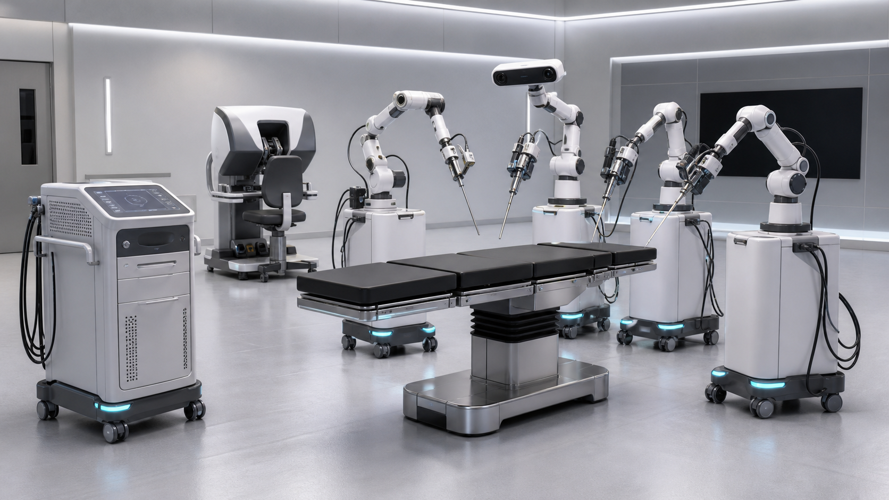

# RobotX OS

An offline-first robotics platform for learning human-like manipulation from
licensed first-person data and acting from a continuously fused spatial world
model.

> Status: planning plus a simulated Phase 1 host-runtime skeleton. No component
> is approved for physical, unattended, or safety-critical operation.

## Mission

Build a modular robotics stack that can:

1. learn useful representations and task priors from large, legally sourced POV
   datasets;
2. adapt those priors to a specific robot using simulation and real robot data;
3. perceive geometry, motion, occupancy, and uncertainty through multiple sensor
   types;
4. plan and execute movement within hard physical safety limits; and
5. operate without an Internet connection in production.

The first product target is **one fixed robot, one controlled room, and a small
set of manipulation tasks**. General-purpose humanoid behavior is a research
direction, not the first milestone.

## What “OS” means here

RobotX OS is a complete robotics platform above a hardened Linux/real-time base.
It includes device abstraction, messaging, time synchronization, world state,
planning, control, learning, safety, observability, and signed offline updates.
It does not initially replace the computer kernel or hardware drivers.

## Design principles

- **Offline by default:** the robot runtime has no Internet route, cloud
  dependency, telemetry upload, or remote shell.
- **Safety outside AI:** a small independent safety controller can stop motion
  even when the main computer or learned policy fails.
- **Uncertainty is data:** every observation and map element carries confidence,
  age, and provenance.
- **Learn proposals, verify commands:** learned models suggest goals or short
  action chunks; deterministic constraints approve, clamp, or reject them.
- **Efficient by architecture:** low-rate semantic reasoning is separated from
  high-rate control, and sensors are processed only at the rate their information
  value requires.
- **Replaceable components:** stable typed contracts allow models, simulators,
  sensors, and robot bodies to change independently.

## Proposed system

```text
POV data + robot demos -> offline training -> signed model bundle
                                               |
Sensors -> time sync -> modality adapters -> fused world model
                                               |
Goal -> task planner -> motion planner -> safety supervisor -> controller -> robot
                                               ^                         |
                                               +---- execution feedback --+
```

See [Architecture](docs/ARCHITECTURE.md), [Sensor Fusion](docs/SENSOR_FUSION.md),
[Learning Plan](docs/LEARNING.md), [Security and Safety](SECURITY.md), and the
[Roadmap](ROADMAP.md).

## Surgical robotics program

RobotX Surgical is the proposed high-risk medical extension for human, dental,
and veterinary procedures. It is a clinician-led program that advances from
navigation and shared control to supervised task autonomy one validated
procedure segment at a time. It does not authorize patient or animal use.

Start with the [Surgical Program Charter](SURGICAL_PROGRAM.md), then review the
[medical architecture](docs/surgical/ARCHITECTURE.md),
[hardware requirements](docs/surgical/HARDWARE_REQUIREMENTS.md),
[robot and extremities reference design](docs/surgical/ROBOT_AND_EXTREMITIES_DESIGN.md),
[manufacturing and assembly guide](docs/surgical/MANUFACTURING_AND_ASSEMBLY_GUIDE.md),
[use and operations guide](docs/surgical/USER_AND_OPERATIONS_GUIDE.md),
[procedure portfolio](docs/surgical/PROCEDURE_PORTFOLIO.md),
[data and training plan](docs/surgical/DATA_TRAINING.md),
[validation pathway](docs/surgical/VALIDATION_CLINICAL.md),
[quality and regulatory plan](docs/surgical/REGULATORY_QUALITY.md),
[operating model](docs/surgical/OPERATIONS.md), and
[contingency playbook](docs/surgical/CONTINGENCY_PLAYBOOK.md).

Full-procedure autonomy is a long-term research objective, not the first product.
Every clinical capability must have a named supervising clinician, bounded
intended use, evidence package, takeover path, and conventional fallback.

### Surgical visual and training package

The [visual design package](docs/surgical/VISUAL_DESIGN_PACKAGE.md) adds four
project renders, three deterministic system diagrams, compact manufacturing and
operating guides, a first virtual-case tutorial, and two silent synthetic-phantom
walkthrough videos. The media demonstrates robot configuration, setup, docking,
surgeon-controlled S2 motion, exchange, safe hold, undocking, and evidence review;
it intentionally omits clinical technique and patient anatomy.



## Relationship to existing projects

- [`robotX`](https://github.com/minagayid/robotX) is the seed for compliant POV
  acquisition, `ClipRecord`, human-to-robot retargeting, VLA interfaces,
  simulation gates, and failure feedback.
- [`TouchAir`](https://github.com/minagayid/TouchAir) is the seed for spatial
  event contracts, tracked object state, confidence gating, and temporal gesture
  stabilization.
- `spatial-mesh` is intended to inform wave-based spatial mapping, but it was not
  accessible while this plan was prepared. Integration waits for an interface
  and license review.

These repositories remain independent during Phase 0. Reuse happens through
documented interfaces or extracted packages, not by copying entire codebases.

## First demonstrator

The recommended first demonstrator is tabletop pick-and-place:

- one 6/7-DoF arm and simple gripper;
- fixed RGB-D camera, wrist camera, joint/force telemetry, and one ultrasonic or
  mmWave safety sensor;
- three known objects in a controlled workcell;
- “pick object A and place it in zone B”;
- offline operation, physical emergency stop, speed/force limits, and automatic
  abort on stale or contradictory perception.

Success means at least 90% completion across a held-out test layout, zero safety
limit violations, and reproducible recovery from expected perception failures.

## Executable Phase 1 skeleton

The first implementation is now in [`src/robotx_os`](src/robotx_os). It provides
versioned runtime contracts, expiring short-horizon commands, deterministic
host-side safety checks, latched stops, a simulation-only actuator, and a local
integrity-checked event journal. It has no third-party runtime dependencies and
runs offline.

See the [implementation guide](docs/IMPLEMENTATION.md) and the draft
[Phase 1 safety case](docs/PHASE1_SAFETY_CASE.md). This code is a behavior
reference and simulation harness; it must not be connected to physical motors.

## Repository policy

This planning repository contains no training data, credentials, private model
weights, or hardware secrets. Future implementation repositories should use
signed releases, dependency lockfiles, reproducible builds, and a documented
software bill of materials.
