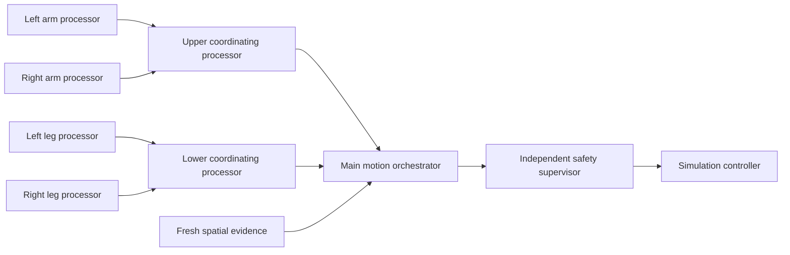

# Architecture

## Layered model

| Layer | Responsibility | Initial choice |
|---|---|---|
| Hardware safety | Emergency stop, watchdog, limit enforcement | Independent MCU/PLC |
| Base system | Boot, process isolation, storage, drivers | Hardened Linux + real-time kernel where needed |
| Device layer | Sensor/actuator adapters and calibration | Typed adapters, hardware timestamps |
| Transport | Local message passing and service discovery | ROS 2/DDS profile or equivalent local-only bus |
| State | Scene graph, occupancy, robot state, uncertainty | Versioned spatial world model |
| Intelligence | Task planning, learned policy, motion planning | Hierarchical planner with deterministic gates |
| Operations | Logs, replay, health, signed updates | Append-only local event log |

ROS 2 is a candidate middleware, not an architectural dependency. Phase 0 must
benchmark latency, memory, fault containment, determinism, and offline behavior
before it is adopted.

## Runtime zones

### Safety zone

Runs on separate hardware. It reads emergency stop, joint limits, speed, force,
watchdog, and selected proximity signals. It can remove actuator power or command
a controlled stop. The AI computer cannot disable or reconfigure this zone at
runtime.

### Real-time control zone

Runs servo control, state estimation, trajectory following, collision checking,
and command arbitration. It accepts only bounded trajectories with deadlines and
valid configuration/model identifiers.

### Cognitive zone

Runs the fused world model, task planner, perception models, and learned policy.
It is allowed to fail without creating unbounded motion. Its outputs are proposals
to the real-time zone, never raw actuator power.

### Engineering zone

Offline workstation for data curation, training, simulation, evaluation, and
building signed deployment bundles. It is physically and logically separate from
the production robot.

## Core contracts

Every contract includes `schema_version`, monotonic timestamp, source ID,
calibration ID, confidence/uncertainty, and sequence number.

- `SensorFrame`: time-aligned raw or minimally processed observation.
- `BodyState`: joints, velocities, efforts, end-effector pose, health.
- `SpatialObservation`: points, detections, ranges, tracks, free-space evidence.
- `WorldSnapshot`: immutable local view of geometry, semantics, occupancy, and age.
- `TaskIntent`: user goal plus constraints and authorization.
- `MotionProposal`: bounded trajectory, actuator-group routing, orchestration ID,
  expected contacts, and validity horizon.
- `SafetyDecision`: approve, clamp, stop, or reject with machine-readable reason.
- `ExecutionEvent`: command, observation, decision, result, and provenance.

The host reference also exposes `SpatialObservation` and `SpatialSnapshot` for
conservative camera-plus-wave evidence fusion. Wi-Fi CSI, ultrasonic, and
mmWave observations remain probabilistic and never become raw actuator input.

## Five-processor movement gate

Movement is deliberately partitioned into five logical processors (“five hearts”
as a coordination metaphor, not a biological equivalence):



Each extremity processor owns a disjoint joint index set and runs the same
fail-closed checks independently. The upper and lower coordinating processors
then aggregate their local pair without committing state. The main orchestrator
requires both regional decisions, all four local decisions, matching calibration
and orchestration IDs, fresh non-contradictory spatial evidence, and a single
atomic commit boundary. Missing, stale, contradictory, or malformed evidence
rejects the complete bundle; it never guesses a missing extremity command.

The existing robotX `ClipRecord` remains a training-side contract and should not
be used as a live control message.

## Planning and control rates

| Loop | Typical rate | Rule |
|---|---:|---|
| Safety monitor | 500–2,000 Hz | No learned model |
| Joint/trajectory control | 100–1,000 Hz | Deterministic and deadline-aware |
| Local collision/motion update | 20–100 Hz | Receding horizon |
| Sensor fusion/world update | 10–60 Hz | Modality-dependent |
| Learned action proposal | 2–20 Hz | Short horizon, interruptible |
| Task/semantic planning | 0.1–2 Hz | Outside control loop |

Rates are hypotheses until measured on target hardware.

## Execution flow

1. Validate and authorize a `TaskIntent`.
2. Freeze a `WorldSnapshot` with freshness requirements.
3. Produce a symbolic subtask and bounded learned/motion proposal.
4. Run kinematic, collision, workspace, speed, force, and uncertainty checks.
5. Four extremity processors validate in isolation.
6. Upper/lower coordinating processors aggregate their local pairs without
   committing state.
7. The main orchestrator admits the complete bundle only if all four local
   decisions, both regional decisions, and spatial evidence are clear.
8. Safety zone approves, clamps, or rejects the admitted bundle.
9. Execute a short horizon while continuously checking watchdog and perception.
10. Replan on deviation; stop on stale state, contradiction, or lost heartbeat.
11. Record the complete event chain for replay and learning.

## Deployment shape

Start as a modular monorepo only after the contracts stabilize:

```text
robotx-os/
  contracts/       versioned schemas and compatibility tests
  drivers/         sensors and actuator adapters
  world_model/     synchronization, fusion, tracking, mapping
  planning/        task and motion planners
  control/         trajectory execution and arbitration
  safety/          host-side checks; MCU firmware lives separately
  learning/        inference adapters and model registry
  simulation/      digital twin, scenarios, evaluation
  ops/             logging, replay, health, offline updates
  tests/           unit, simulation, hardware-in-loop, fault injection
```

## Make-or-buy decisions for Phase 0

- Benchmark ROS 2/DDS versus a smaller local transport before committing.
- Use established kinematics, motion planning, and simulation libraries before
  writing custom equivalents.
- Keep learned-policy runtimes behind an adapter (ONNX/TensorRT/OpenVINO or target
  equivalent) and select using measured latency, memory, and accuracy.
- Prefer sensor hardware with deterministic timestamps and documented offline
  drivers.

