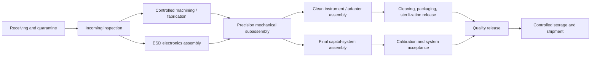

# Surgical Robot Manufacturing and Assembly Guide

> **Quality-system tutorial — not a home-build guide.** Surgical hardware must be
> produced by qualified personnel under a medical-device quality system from
> controlled design outputs. A machine shop prototype, open-source parts list, or
> successful bench demo is not acceptable for clinical use.

## 1. Manufacturing objective

Produce a traceable, repeatable system in which every released unit matches the
verified design and every safety-critical characteristic has:

- a controlled specification and risk link;
- a capable manufacturing or assembly process;
- an approved supplier and material/process record;
- a calibrated inspection or test method;
- acceptance criteria and data retention;
- nonconformance and change-control rules; and
- service and end-of-life controls.

The US FDA Quality Management System Regulation (QMSR) became effective on
February 2, 2026 and incorporates ISO 13485:2016. Investigational devices are not
exempt from its design and development expectations. The program shall establish
its QMS before clinical prototypes, not after design freeze.

## 2. Manufacturing file structure

Maintain these controlled layers:

| File | Contents |
|---|---|
| Design and development file | User needs, inputs, outputs, reviews, risk management, verification, validation and design transfer |
| Device master/manufacturing record | BOM, drawings, software, recipes, work instructions, fixtures, inspections, labels and packaging |
| Device history/build record | Unit serial/lot, actual components, operators, equipment, results, deviations, release |
| Risk management file | Hazards, controls, verification, residual risk, production/post-production feedback |
| Supplier file | Qualification, agreements, audits, certificates, change notification and performance |
| Calibration/maintenance file | Measurement equipment, production fixtures, intervals, status and out-of-tolerance impact |
| Instrument life record | Lot/serial, sterilization/reprocessing cycles, use count, inspection, quarantine and retirement |
| Software/configuration record | Source/build identity, SBOM, signatures, hardware compatibility, installation and rollback |

Records must identify the exact hardware, software, firmware, model, calibration,
instrument, process, and test-method revision.

## 3. Critical-to-quality classification

Classify characteristics before supplier selection:

| Class | Example | Control expectation |
|---|---|---|
| CTQ-S — safety critical | Brake torque, hard stop, insulation, sterile barrier, tool retention, energy interlock | 100% verified where feasible; locked process; strict change notice |
| CTQ-P — performance critical | Link datum, bearing preload, tip backlash, encoder alignment, optical calibration | Capability study plus unit acceptance |
| CTQ-R — reprocessing/biological | Material/finish, lumen geometry, weld/adhesive, residue, packaging seal | Material/process trace and validated worst-case process |
| CTQ-C — cosmetic/noncritical | Nonfunctional cover color or minor finish away from cleaning interfaces | Defined visual standard and sampling |

Do not hide CTQ-S or CTQ-R features inside an uncontrolled supplier drawing.

## 4. Make-or-buy strategy

### Buy qualified components where possible

- medical-grade power entry, isolation components and approved power supplies;
- safety controller/drive functions appropriate to the safety concept;
- motors, encoders, bearings, brakes, cables and connectors with lifecycle data;
- legally marketed endoscopes, energy generators and compatible accessories;
- calibrated force/torque sensors and metrology equipment;
- validated sterilization and packaging services.

### Keep design authority in-house

- system safety architecture and state machine;
- kinematics, dynamics, calibration and tip-error budget;
- arm/link interfaces and critical datums;
- sterile adapter and instrument coupling;
- instrument identity/life and compatibility rules;
- clinical console mapping and alarm behavior;
- manufacturing acceptance limits and release decision;
- configuration signing, logging and traceability.

Buying a “medical-grade” component does not qualify the assembled medical system.

## 5. Supplier qualification tutorial

1. Identify the supplied item, its CTQ class, applicable process, and failure
   effect.
2. Review supplier quality certification, technical capability, traceability,
   process validation, cybersecurity where applicable, business continuity, and
   sub-tier controls.
3. Approve the exact site and process, not only the corporate supplier.
4. Execute a quality agreement covering specifications, records, nonconformance,
   complaint support, audits, and advance change notification.
5. Build and inspect qualification lots across expected process variation.
6. Establish incoming acceptance and certificate verification.
7. Monitor defects, delivery, escapes, corrective action, and unannounced changes.
8. Requalify after significant process/site/material/tooling changes or adverse
   trends.

Safety-critical firmware in a purchased drive, encoder, camera, or battery is a
supplier-controlled design input and requires version/change visibility.

## 6. Factory layout

Separate flows to prevent mix-up and contamination:

Minimum controlled areas:

- receiving/quarantine and nonconforming material segregation;
- dimensional metrology with environmental control;
- ESD-protected electrical assembly;
- lubricated/mechanical assembly separated from clean instrument assembly;
- controlled clean area appropriate to the product/process;
- software provisioning and cryptographic signing station;
- calibration and motion-test cell with physical guarding;
- electrical safety/EMC pre-compliance area;
- packaging/label control;
- released-product and returned-product segregation.

The cleanroom classification, environmental monitoring, and gowning level are
process outputs—not assumptions. Derive them from sterile barrier, bioburden,
particle, optical, and instrument assembly needs.

## 7. Capital robot manufacturing flow

### 7.1 Receiving and incoming inspection

- Verify part number/revision, supplier/site, purchase order, lot/serial,
  certificates, shelf life, packaging, and change status.
- Inspect CTQ dimensions/materials/finishes with the approved sampling or 100%
  plan.
- Quarantine suspect, damaged, expired, counterfeit, or undocumented items.
- Record electronic component and firmware revisions where they affect
  compatibility or cybersecurity.

### 7.2 Base and structural frame

1. Inspect weldments/castings/machined frames for material, heat treatment, cracks,
   distortion, critical datums, surface finish, coating, and grounding points.
2. Install casters, brakes/locks, ballast, cable passages, and protective earth.
3. Torque fasteners with calibrated tools and recorded sequence.
4. Verify base geometry, lock sensing, transport force, stability fixture
   interface, and protective-earth continuity.

Avoid untraceable field-added ballast or drilling after qualification.

### 7.3 Joint module

Typical controlled build:

1. clean and inspect housing, shaft, bearings, transmission and hard stops;
2. install bearings with specified method and force/temperature limits;
3. set and record preload/backlash;
4. install motor, brake, encoder(s), temperature sensor and local electronics;
5. apply only specified lubricant/adhesive with lot, amount and cure record;
6. torque and witness-mark CTQ fasteners;
7. route harnesses to controlled bend radius and strain relief;
8. program allowed firmware and component identity;
9. run no-load friction, backlash, encoder agreement, brake, thermal, noise and
   dielectric/grounding tests as applicable.

Press fits, adhesive bonds, soldering, crimping, welding, coating and cleaning
processes need qualification or validation when the result cannot be fully
verified later.

### 7.4 Arm assembly

1. Confirm released joint modules and links.
2. Assemble from the base outward using datum-controlled fixtures.
3. Verify harness routing at every joint throughout motion.
4. Install covers, guards, labels, manual-release access and local controls.
5. Measure joint zero, hard-stop margin, link parameters and brake holding.
6. Load the unit-specific kinematic calibration record.
7. Execute guarded low-speed motion, workspace, collision, load and thermal
   acceptance.

Never compensate a dimensional nonconformance by silently changing calibration.
Engineering disposition must determine whether the part, design, or calibration
process changes.

### 7.5 Safety/power and compute carts

- Build with controlled wire lists, terminal torques, crimp pull tests, protective
  separation, shielding, grounding, airflow, filters and tamper controls.
- Record safety controller, drive, BIOS/firmware, secure-boot, storage and network
  identities.
- Perform continuity, polarity, insulation, leakage/pre-compliance, emergency
  chain, contactor weld detection, brake, brownout, UPS and thermal tests.
- Provision signed software only after hardware inspection; verify a clean restore
  and rollback.

### 7.6 Console

- Verify structural stability, adjustment stops, master calibration, clutch and
  presence/enable controls, pedal identity/guarding, display geometry, audio,
  emergency stop, cleaning surfaces and cable routing.
- Run stuck, swapped, intermittent and out-of-range control tests.
- Store the unit’s input/output calibration and display-path identity.

## 8. Sterile adapter and instrument manufacturing

### 8.1 Material control

Freeze resin/metal grade, supplier, manufacturing site, formulation, colorant,
surface treatment, lubricant, adhesive, processing aid, cleaning chemistry and
residue limits. A “same nominal material” substitution is a design change.

### 8.2 Precision components

- Define datums from the functional tip/coupling, not convenient cosmetic faces.
- Control shaft straightness, concentricity, drive features, jaw alignment, cable
  paths, pulley grooves, crimp dimensions, insulation, lumen and seal geometry.
- Inspect burrs, edges, loose particles, weld spatter and retained fragments under
  specified magnification.

### 8.3 Cable/tendon assembly

1. Verify cable material, strand, coating and lot.
2. Cut with a controlled process that prevents fray or heat damage.
3. Form/crimp/terminate in a qualified fixture.
4. Proof-load terminations.
5. Route without cross-over or surface damage.
6. Apply controlled pretension and record it.
7. Cycle/settle where specified, then calibrate output motion and jaw force.
8. Seal and inspect without creating uncleanable spaces.

### 8.4 Bonding, welding and insulation

Qualify laser weld, resistance weld, braze, adhesive cure, overmold and insulation
processes using worst-case geometry and material lots. Monitor the process
parameters that determine joint strength, corrosion, residue, biocompatibility,
electrical insulation, and cleanability. Destructive validation does not eliminate
the need for routine process controls.

### 8.5 Instrument end-of-line acceptance

At minimum:

- identity and configuration read/write check;
- dimensional and visual inspection;
- latch and wrong-orientation rejection;
- full articulation and travel;
- backlash/hysteresis or output-position check;
- jaw/end-effector force and manual release;
- proof load and retained-part inspection;
- lumen patency/leak/flow where applicable;
- electrical continuity, insulation/leakage and energy-interface test where
  applicable;
- calibration generation and signature;
- cleanliness/bioburden or packaging inputs appropriate to the process.

Sample-based destructive testing and endurance are added by the risk plan.

## 9. Cleaning, sterilization and packaging design transfer

### Reusable device path

1. Define point-of-use treatment and maximum delay before cleaning.
2. Validate disassembly, cleaning, rinsing, drying and inspection with clinically
   relevant worst-case soil and worst-case locations.
3. Validate the selected disinfection/sterilization method, load configuration,
   packaging and maximum cycle count.
4. Verify function, materials, markings, insulation, corrosion, force and
   calibration after maximum claimed cycles plus justified margin.
5. Validate the instructions with representative reprocessing staff and equipment.

### Sterile single-use path

1. Establish bioburden and packaging processes.
2. Select a sterilization modality compatible with every material, electronic
   element, lubricant, adhesive, sensor and package.
3. Validate the sterilization cycle and sterile barrier system.
4. Address residuals, endotoxin/pyrogen where applicable, aging, distribution and
   seal integrity.
5. Release product only through the approved sterilization and quality records.

FDA’s January 2024 sterility guidance describes premarket information for devices
labeled sterile. The final method, sterility assurance claim, packaging,
residual/endotoxin strategy, and submission content require sterile-device
specialists and regulator confirmation.

## 10. Software and calibration provisioning

- Use an isolated, access-controlled station with reproducible signed builds.
- Verify device serial, secure identity, hardware revision and approved bundle
  compatibility before installation.
- Store factory keys in protected infrastructure; never export them to general
  developer workstations or service laptops.
- Generate calibration from traceable equipment and retain raw measurements,
  algorithm version, environmental conditions, operator and result.
- Sign calibration and bind it to the exact arm/instrument/configuration.
- Verify startup rejection of an altered, stale, foreign or incompatible
  calibration.
- Ship with an approved recovery image and tested rollback, not developer access.

## 11. End-of-line system acceptance

| Station | Required checks |
|---|---|
| Visual/build audit | Correct revision, labels, guards, cleanliness, fasteners, seals, service access |
| Electrical safety | Grounding, isolation/leakage as applicable, fuses, power modes, emergency chain |
| Motion metrology | Joint zero, encoder agreement, workspace, speed, repeatability, loaded tip accuracy |
| Mechanics | Brake holding, manual release, base locks, stability, hard stops, payload |
| Instruments | Identity/latch, drive channels, tip mapping, release, expired/incompatible rejection |
| Safety faults | Watchdog, stale command, sensor disagreement, bus loss, brownout, display/video loss |
| Thermal/soak | Worst-case representative configuration and duration; alarms and shutdown |
| Logging/configuration | Time sync, integrity, storage-full response, crash recovery, signed manifest |
| Cleaning/packout | Surface condition, accessories, manuals, release documents, transport restraints |

The acceptance test must use the released production software, fixtures, limits,
and instructions. Engineering tools cannot bypass a failing release test.

## 12. Process validation and capability

Validate processes when output cannot be fully verified without destroying the
product or when later verification is insufficient. Examples include:

- sterile barrier sealing and sterilization;
- cleaning and disinfection;
- welding, brazing, crimping, bonding and overmolding;
- heat treatment, passivation and coating;
- soldering and cable terminations where inspection alone is inadequate;
- firmware/security provisioning;
- automated calibration and test software.

For each validated process define inputs, operating window, equipment,
maintenance, operator qualification, monitoring, acceptance, revalidation
triggers, and response to excursions. Statistical capability targets must be
risk-based; a high capability index does not excuse an incorrect specification or
biased measurement system.

## 13. Pilot-build progression

| Build | Purpose | Exit |
|---|---|---|
| EVT — engineering verification | Compare architecture, joints, RCM, instruments, sensors and safety concepts | Selected concept and retired major technical risks |
| DVT — design verification | Build from near-production drawings/processes and verify requirements | Locked design with completed verification and risk controls |
| PVT — process validation | Use production tooling, suppliers, operators, records and test stations | Capable validated processes and complete device history records |
| Clinical investigation units | Locked authorized configuration under QMS | Protocol/ethics/regulator release and site accountability |
| Commercial production | Authorized design and labeling only | Formal quality release and postmarket controls |

Unit counts are set by risk, process variation and statistical plans—not by these
labels.

## 14. Nonconformance and change control

- Physically and electronically quarantine nonconforming product.
- Record the requirement, lot/serial, process, detection point and possible escaped
  population.
- Use, repair, rework or concession only through authorized risk-aware
  disposition; “use as is” is never an operator decision.
- Re-run affected tests after rework and preserve the original failure record.
- Investigate trends and supplier escapes through corrective/preventive action.
- Assess every material, supplier, tool, process, firmware, software, calibration,
  packaging and labeling change for verification, validation, regulatory and
  field impact before implementation.
- Maintain backward/forward compatibility rules and a service/recall population
  query.

## 15. Installation and site acceptance

Before first use at a site:

1. verify room power, grounding, network isolation, floor, doors, lift/transport,
   storage, cleaning, sterile processing, EMC sources and emergency power;
2. inventory and inspect all serialized units, accessories, release tools and
   conventional fallback equipment;
3. install the authorized bundle and site configuration;
4. perform electrical, motion, accuracy, video, communications, emergency,
   release and recovery acceptance;
5. validate instrument/reprocessing workflow and local labeling access;
6. complete staff training and proficiency records;
7. run full-room simulated cases including conversion;
8. release the site only through quality, clinical and service sign-off.

## 16. Service and refurbishment

Service tools require role-based physical access and audit. Define replaceable
units, inspection, calibration, safety tests, software compatibility and return-
to-service approval. Returned equipment is treated as contaminated until
decontamination status is verified. Refurbished units retain full traceability and
cannot silently receive substituted parts or expanded capabilities.

## 17. Primary references

- [FDA Quality Management System Regulation](https://www.fda.gov/medical-devices/postmarket-requirements-devices/quality-management-system-regulation-qmsr)
- [FDA reusable-device reprocessing guidance](https://www.fda.gov/regulatory-information/search-fda-guidance-documents/reprocessing-medical-devices-health-care-settings-validation-methods-and-labeling)
- [FDA factors affecting reprocessing quality](https://www.fda.gov/medical-devices/reprocessing-reusable-medical-devices/factors-affecting-quality-reprocessing)
- [FDA sterility information guidance for devices labeled sterile](https://www.fda.gov/media/74445/download)
- [FDA EMC guidance for medical devices](https://www.fda.gov/regulatory-information/search-fda-guidance-documents/electromagnetic-compatibility-emc-medical-devices)
