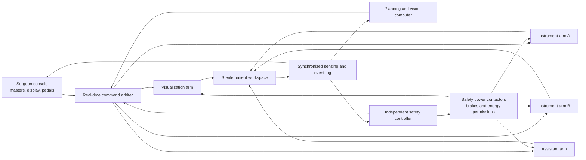
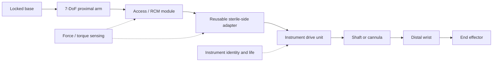

# Robot and Extremities Reference Design

> **Engineering concept only.** This is a requirements-allocation and prototype
> tutorial, not production drawings, a bill of materials for clinical use, or
> permission to connect a prototype to a person or animal.

## 1. Architecture choice

Use independent mobile bedside units rather than one universal monolithic boom for
the first platform. A modular layout gives the team room to evaluate access,
collision, transport, failure isolation, and procedure-specific arm counts before
committing to a ceiling or central-cart architecture.



The planning computer may propose motion. Only the real-time arbiter can issue
short-lived drive commands, and only while the independent safety controller
permits the associated mode, arm, instrument, workspace, and energy state.

## 2. Physical system decomposition

### 2.1 Surgeon console

- Adjustable seated/standing workstation with neutral ergonomic posture.
- Two 6-DoF master manipulators with grasp input, enable state, clutch, and
  bounded force feedback only where validated.
- Stereoscopic primary display and an independent status/alarm path.
- Guarded foot controls for clutch, camera, instrument pair, and approved energy
  device; pedal mapping is physically and visually distinguishable.
- Presence/attention strategy derived from human-factors work, not facial
  recognition or opaque behavior inference.
- Local emergency stop and a clear handoff/takeover control.

### 2.2 Compute and visualization cart

- Safety-partitioned real-time controller for teleoperation and trajectory
  execution.
- Separate perception/planning computer with no direct motor-power authority.
- Video acquisition, light source/endoscope integration, local case storage, and
  time synchronization.
- Hardware root of trust, signed offline updates, A/B rollback, service port
  under physical access control, and no clinical Internet route.

### 2.3 Safety and power unit

- Independent safety controller, safety-rated inputs/outputs as supported by the
  final safety concept, drive-enable relays/contactors, brake control, emergency
  stop chain, and energy-device permission outputs.
- Dedicated power-health, temperature, communications-watchdog, and cabinet
  interlock channels.
- Enough stored energy for the validated controlled stop/hold and manual release;
  it is not an unbounded surgical backup power supply.

### 2.4 Bedside unit

Each unit contains:

1. mobile base and positive floor locks;
2. isolated power and communication entry;
3. vertical lift or setup axis if required by the room envelope;
4. 7-DoF proximal positioning arm;
5. distal access/remote-center alignment mechanism;
6. sterile boundary interface;
7. instrument drive or visualization interface; and
8. local stop, manual positioning, status indication, and release points.

## 3. Extremity stack



### 3.1 Proximal arm

Use a serial 7-DoF architecture for setup dexterity and obstacle avoidance:

- base yaw;
- shoulder pitch/roll;
- elbow pitch;
- forearm roll;
- wrist pitch/yaw.

The exact joint order is selected through workspace and collision simulation. A
joint arrangement is acceptable only if it can reach the locked procedure
workspace with the specified tool while avoiding unsafe singularities, staff
zones, the patient, other arms, and the table.

Design principles:

- low reflected inertia near the patient;
- counterbalance or gravity compensation before increasing motor size;
- absolute position at power-up;
- normally engaged brakes on gravity-loaded axes;
- joint hard stops outside software limits;
- rounded, cleanable covers with minimal traps and pinch exposure;
- strain-relieved internal harnesses with known bend radius and life;
- a deliberate compliant setup mode with local enable;
- visible arm identity and status from console and bedside.

### 3.2 Access/remote-center module

For rigid minimally invasive tools, keep the shaft rotating and translating about
the prescribed access point. Evaluate three concepts:

| Concept | Benefit | Main risk |
|---|---|---|
| Mechanical parallelogram RCM | Geometric constraint persists through some software faults | Backlash, mass and a fixed pivot geometry |
| Software/kinematic RCM | Flexible virtual pivot and lighter mechanism | Calibration and control faults can load the access site |
| Hybrid RCM | Mechanical coarse constraint plus monitored virtual correction | More parts and a harder verification case |

The recommended research design is hybrid: a mechanically constrained distal
alignment stage, tip/shaft kinematic monitoring, and an instrumented access
fixture during bench work. The release design is chosen only after pivot error,
load, sterilization interface, and failure behavior are compared.

### 3.3 Sterile boundary

Use three controlled layers:

1. **non-sterile arm nose** — sealed, disinfectable, never presented as sterile;
2. **sterile drape and reusable sterile adapter** — barrier plus mechanical
   coupling; and
3. **sterile instrument** — single-use or validated reusable item.

The coupling should be keyed, one-hand verifiable, impossible to half-latch
without detection, and unable to transfer motion until identity and latch channels
agree. Avoid exposed rotating shafts through the drape where a sealed magnetic,
diaphragm, or contained mechanical coupling can meet torque and verification
needs. The selected coupling needs barrier, particle, torque, backlash, and
reprocessing validation.

### 3.4 Instrument drive unit

Reference channels:

- shaft insertion/retraction;
- shaft roll;
- distal wrist pitch and yaw;
- jaw or end-effector open/close;
- optional independent accessory channel.

The drive unit remains outside or at the sterile boundary. Use individual motor
encoders, output-side position or tension evidence where practical, drive-current
monitoring, mechanical travel stops, and a manual release. Cable/tendon systems
must model stretch, friction, hysteresis, creep, routing, pulley wear, and cycle
life. Motor position alone is not proof of jaw position.

### 3.5 Shaft and distal wrist

- Prefer a common outer shaft family only where procedure access and instruments
  genuinely share diameter, length, stiffness, and sterilization needs.
- Separate load-bearing structure from electrical insulation and fluid paths.
- Eliminate hidden dead legs and inaccessible internal soil on reusable designs.
- Control bending stiffness so external shaft contact is detectable rather than
  silently absorbed.
- Use distal hard stops and retained fasteners.
- For tendon wrists, provide pretension control and end-of-line calibration.
- For energy instruments, route conductors with creepage/clearance, insulation,
  thermal, leakage, and flex-life appropriate to the energy source.

### 3.6 End effector

Create a separate device specification for every tip. Minimum design records:

- intended tissue/object interaction;
- jaw geometry and surface;
- open/closed envelope;
- maximum and minimum useful force;
- force versus drive displacement and life;
- blade/needle/clip retention;
- allowable energy/fluid interface;
- temperature and cool-down behavior;
- material/contact classification;
- cleaning or sterile single-use strategy;
- failure detection and manual release;
- dimensional inspection and functional acceptance method.

## 4. Arm roles and swappable extremities

### Visualization arm

Carries a validated stereo endoscope or microscope interface. It emphasizes stable
pose, optical calibration, light/thermal management, cleaning, fog/smoke
detection, and rapid bedside repositioning. It has no instrument energy output.

### Manipulation arm

Carries forceps, graspers, scissors, needle drivers, or retractors. It emphasizes
low backlash, tip-level force characterization, reliable release, and instrument
identity/life tracking.

### Energy-capable arm

Mechanically it may share a manipulation arm, but authorization is separate.
Energy remains disabled unless the exact instrument, generator/accessory,
operator control, patient circuit where applicable, workflow state, and
independent permission chain are valid.

### Assistant/fluid arm

Carries suction/irrigation, smoke evacuation, a probe, or a retractor. Fluid paths
are sterile disposables or validated reusable channels and use keyed connectors
to prevent cross-connection.

### Rigid guidance arm

For dental or orthopedic research, replace the RCM extremity with a rigid,
force-sensing guide/drill interface. Its defining controls are registration
quality, tracking, trajectory and depth hard stops, runout, heat, debris, and
immediate clinician override. It is not interchangeable with the soft-tissue
configuration without a new hazard and evidence package.

## 5. Actuation and transmission selection tutorial

### Step 1 — define the task envelope

For each procedure segment, record:

- allowed tool-tip workspace and orientation;
- access point or corridor;
- tool mass, center of mass, and cable/hose load;
- continuous and peak tissue/tool forces;
- allowed speed, acceleration, and contact energy;
- precision and stiffness needed at the tip;
- setup and manual-release forces;
- worst-case duration, duty cycle, and room environment.

Do not size from nominal instrument weight alone.

### Step 2 — solve kinematics and collision

Generate a digital human/patient/table/arm model. Sample the full anatomical and
room envelope. Reject designs with:

- required poses near joint limits or singularities;
- unobservable self-collisions;
- blocked bedside access or conversion path;
- cable bends below their qualified radius;
- a remote center that cannot cover the port range; or
- manual-release directions that load the patient.

### Step 3 — calculate joint loads

For pose \(q\), the starting torque budget is:

```text
τ_required(q) =
    J(q)ᵀ F_tip
  + τ_gravity(q)
  + τ_inertia(q, q̇, q̈)
  + τ_friction
  + τ_cable/hose
  + uncertainty margin
```

Evaluate every allowed pose, including setup and fault stopping. Select motors,
gearing, bearings, brakes, shafts, and fasteners from the worst credible load and
the required life, then verify the assembled unit. A large motor is not a
substitute for low inertia, counterbalance, or safe force limiting.

### Step 4 — allocate tip error

Create a root-sum-square estimate only when contributors are independent; also
calculate a conservative worst-case stack:

```text
tip error contributors =
  link and joint tolerances
  + encoder and homing error
  + gear backlash/compliance
  + thermal growth
  + base/floor deflection
  + shaft/wrist deflection
  + instrument calibration
  + tracking/registration error
  + time-alignment error during motion
```

Measure error at the tool tip, through the full claimed workspace, load, life,
temperature, and arm arrangement. Reporting unloaded joint repeatability is
insufficient.

### Step 5 — size stiffness and stopping

For each direction at the tip:

```text
deflection ≈ compliance(q) × applied load
```

Derive allowed kinetic energy, stopping distance, and access-site load from the
hazard analysis. Include detection latency, computation, drive response, brake
engagement, structural compliance, and the moving mass. Do not specify an
emergency-stop time without its stopping distance and resulting tissue load.

### Step 6 — close the thermal budget

Sum motor copper loss, drive loss, compute/optical heat, braking duty, and
environmental worst case. Verify continuous operation, draped operation, blocked
vent scenarios, sensor faults, and safe shutdown. Surface temperature and sterile
field airflow are system requirements, not just electronics checks.

### Step 7 — select transmission

| Transmission | Good fit | Design cautions |
|---|---|---|
| Direct/low-ratio torque motor | Low friction, good backdrivability | Size, heat, brake and cost |
| Harmonic/strain-wave gear | Compact high ratio, low nominal backlash | Compliance, hysteresis, wear and reflected inertia |
| Cycloidal/planetary gear | Robust proximal joints | Backlash, noise and inertia |
| Cable/tendon | Light distal wrist | Stretch, friction, creep, routing and replacement |
| Belt | Quiet remote drive | Tension, particles, wear and guarding |
| Ball/lead screw | Insertion or linear setup axis | Backdrive behavior, lubrication and pinch |

No transmission is “medical grade” by name. The complete assembly must meet its
requirements after manufacturing variation, cleaning, transport, and use life.

## 6. Sensing architecture

Recommended evidence channels:

- dual-channel joint position on safety-relevant axes where justified;
- motor current and drive diagnostics;
- brake state and base-lock state;
- six-axis force/torque at or near the distal arm interface for research;
- output-side instrument position/tension for tendon-driven instruments;
- instrument latch, identity, life, and sterile-status channels;
- stereo/endoscopic images with hardware timestamps;
- optional external optical tracking for metrology, not automatically as the
  only safety boundary;
- access-fixture load cells on the bench;
- temperature at motors, drives, instrument/energy interfaces, optics, cabinet,
  and battery; and
- power, isolation, storage, timing, and network health.

Sensor fusion must preserve disagreement. It must not average two contradictory
sensors into a plausible but unsafe value.

## 7. Control allocation

| Layer | Typical rate | Responsibility | Prohibited |
|---|---:|---|---|
| Drive current/torque loop | Drive internal, high rate | Motor commutation and current limit | Anatomy or workflow decisions |
| Joint/tip servo | Research target ≥1 kHz | Trajectory tracking, gravity/friction compensation | Long-horizon learned planning |
| Independent safety monitor | Research target ≥1 kHz for motion | Limits, command age, disagreement, safe-state request | Being overridden by the planner |
| Teleoperation mapping | 200–1000 Hz as justified | Scaling, clutch, coordinate mapping, virtual fixtures | Direct raw master-to-motor coupling |
| Perception/world model | Sensor dependent | Anatomy/tool state and uncertainty | Hiding stale/invalid estimates |
| Task/workflow supervisor | Event/segment rate | Preconditions, checkpoints, permissions | Expanding intended use or limits |

Rates are allocation examples. The locked configuration requires worst-case
latency and jitter measurements with processor, bus, storage, video, and thermal
stress.

## 8. Safe-state mechanics

Design each extremity for these events:

- main power loss;
- planning computer crash;
- real-time controller loss;
- network partition;
- encoder disagreement;
- brake failure;
- force sensor saturation;
- shaft collision or access-load rise;
- instrument stall, tendon break, or jaw disagreement;
- display/video loss;
- tool stuck in tissue;
- energy output stuck on;
- sterile barrier or instrument latch uncertainty.

The safe response is stored in the instrument/procedure configuration and checked
by the independent controller. For a grasper holding tissue, “hold then
clinician-controlled release” may be safer than retract. For an energy instrument,
energy hard-disable is always independent from motion behavior.

## 9. Prototype sequence

1. Build a fully simulated four-arm digital workcell.
2. Build one non-sterile arm with a blunt instrumented rod and transparent guard.
3. Characterize workspace, load, gravity compensation, timing, stopping, and
   manual release.
4. Add the access/RCM fixture and measure pivot load/error on a rigid phantom.
5. Add a separable sterile-boundary mock-up; validate coupling detection, not
   sterility yet.
6. Add a blunt tendon wrist and tip-level metrology.
7. Add visualization and a second arm; test collisions and team access.
8. Add sterile adapter/instrument manufacturing under the quality system.
9. Conduct full reprocessing, electrical, EMC, usability, and fault-injection
   validation before any cadaver/ex-vivo or approved animal work.
10. Freeze one procedure-specific configuration before formal verification.

At no step does success on a phantom authorize patient or animal use.

## 10. Design outputs required before transfer

- controlled system and subsystem requirements;
- CAD, drawings, tolerances, materials, finishes, and critical characteristics;
- kinematic/dynamic model and calibration method;
- electrical schematics, harness drawings, power and grounding plan;
- software/hardware interfaces and safety communications;
- instrument and sterile-boundary specifications;
- manufacturing BOM and approved supplier list;
- assembly, inspection, calibration, and acceptance procedures;
- risk controls and trace matrix;
- service, preventive maintenance, and manual-release procedures;
- packaging, sterilization/reprocessing and biocompatibility strategy;
- verification protocols/reports and unresolved-anomaly assessment.

## 11. Regulatory design references

FDA describes currently regulated RAS systems as surgeon-controlled systems that
commonly include a console, three or four mechanical arms, a camera/endoscope,
instruments, and a supporting equipment cart. FDA’s Versius De Novo summary is
one public example of independent bedside units and arm modes, while the Galen
De Novo summary illustrates a force/torque-sensing cooperative arm with separable
sterile and single-use adapters. These are design precedents, not specifications
to copy.

- [FDA computer-assisted surgical systems overview](https://www.fda.gov/medical-devices/surgery-devices/computer-assisted-surgical-systems)
- [FDA Versius De Novo summary (DEN230078)](https://www.accessdata.fda.gov/cdrh_docs/reviews/DEN230078.pdf)
- [FDA Galen ES De Novo summary (DEN220047)](https://www.accessdata.fda.gov/cdrh_docs/reviews/DEN220047.pdf)
