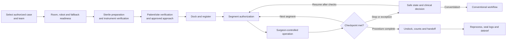

# Surgical Robot Use and Operations Guide

> **Research-system draft labeling. Not for clinical, dental, or animal use.**
> This guide explains how a trained team operates the RobotX platform. It does
> not teach a surgical procedure, replace clinical judgment, or authorize a
> procedure. Actual patient-use instructions must be validated and supplied with
> the authorized device, indication, configuration, and site protocol.

## 1. Purpose and operating principle

RobotX converts a qualified operator’s master-control motions into bounded
patient-side instrument motions. The system:

- never selects the patient, diagnosis, procedure, anatomy, or treatment goal;
- never expands its procedure, instrument, energy, force, speed, or autonomy
  permission;
- requires explicit operator authority and procedure-segment checkpoints;
- stops or holds in a defined safe state when required evidence is missing; and
- preserves immediate bedside stop, manual release, and conventional conversion.

FDA describes marketed RAS devices as computer-assisted systems controlled by a
trained physician. RobotX’s first clinical target is the same surgeon-controlled
model (S1/S2), not unattended surgery.

## 2. Intended users and roles

Only personnel trained and currently qualified on the exact system model,
procedure configuration, and role may operate it.

| Role | Authority |
|---|---|
| Responsible clinician | Patient/procedure decisions, motion authorization, segment checkpoints, conversion |
| Console operator | Controls selected instruments within the responsible clinician’s authority |
| Bedside assistant | Drape, dock, exchange instruments, manage access and execute manual release |
| Scrub/circulating staff | Sterility, instrument/accessory counts, room workflow and documentation |
| Anesthesia/physiology team | Independent patient physiology and anesthesia authority |
| Technical support | Equipment troubleshooting only; no clinical decisions or safety-limit overrides |
| Safety monitor for investigations | Independent stop and protocol-pause authority |

A trained backup clinician and conversion leader are assigned before an
investigational case.

## 3. Operating modes

| Mode | Patient-side behavior | Entry |
|---|---|---|
| Transport | Arms folded/secured; drives unavailable; base may roll | Service/transport procedure |
| Parked | Base locked as required; arms held; no instrument motion | Power-on default |
| Setup compliant | One selected arm is gravity compensated for bedside positioning | Local hold-to-enable plus console permission |
| Calibration/test | Restricted automated motion with no patient and controlled fixture | Authorized test workflow |
| Docked/standby | Arms positioned and instruments identified; no master control | Completed setup checks |
| Teleoperation S2 | Selected arm pair follows enabled master controls within limits | Console enable and valid workflow state |
| Shared control S2 | Operator controls motion with validated virtual fixtures/scaling | Explicit mode selection and confirmation |
| Bounded task S3 | Locked research-only task while operator continuously observes | Protocol authorization and checkpoint |
| Safe hold/stop | Energy off; motion held, braked, or released as defined | Fault, operator stop or workflow pause |
| Manual release | Bedside team uses validated release path | Motion disabled and team confirmation |
| Service | Guarded diagnostics; not available during a case | Credentialed service access |

Mode changes are announced at console and bedside. If the team cannot state the
active mode and controlling user, motion remains disabled.

## 4. Control reference

### Console

- **Master enable:** permits mapped motion only while all other conditions remain
  valid.
- **Clutch:** decouples master position from instrument position so the operator
  can recenter; it does not move an instrument.
- **Instrument-pair select:** chooses which validated arm pair is mapped.
- **Camera control:** selects the visualization arm; distinct feedback prevents
  accidental instrument motion.
- **Energy pedal:** requests the selected approved energy output; the independent
  permission chain may reject it.
- **Stop:** requests the validated safe state for active instruments.
- **Emergency stop:** disables hazardous output through the independent chain.

### Bedside unit

- **Local emergency stop:** stops hazardous output for the system.
- **Setup enable:** hold-to-enable for manual arm positioning in setup mode.
- **Arm status indicator:** identity, locked/setup/docked/fault state.
- **Base-lock indicator:** direct evidence that the required locks are engaged.
- **Manual release:** labeled mechanical access used only after motion and energy
  are disabled and the clinical team directs the release.

Control names, shapes, colors and behavior are finalized through usability
engineering; this draft does not prescribe the final panel.

## 5. Full-case operating state model

The procedure dossier supplies the clinical content between checkpoints. The
robot guide supplies only system setup, control, limits, alarms, and recovery.

## 6. Installation and daily readiness

Do not use a unit whose site acceptance, preventive maintenance, calibration,
training, instrument life, software authorization, or reprocessing state is
expired.

Daily readiness:

1. Inspect carts, covers, connectors, wheels/locks, arms, adapters, release tools,
   console, displays, pedals and cables for damage or contamination.
2. Confirm room power, emergency power, network isolation and clear transport/
   conversion paths.
3. Power on with arms clear and observe the startup self-test.
4. Confirm system clock, storage, signed configuration, device identities,
   calibration status and no unresolved service lockout.
5. Test console and bedside emergency stops, base locks, brakes, manual setup
   enable, alarms and backup-power transition using the approved test workflow.
6. Run the approved arm/instrument fixture check; never use a person as a
   calibration target.
7. Confirm required conventional instruments, visualization and conversion
   equipment are present.
8. Record pass/fail. A failed safety check cannot be deferred by technical support.

## 7. Pre-case workflow

### 7.1 Clinical and configuration verification

- Confirm patient, procedure, site/side, consent, indication, inclusion/exclusion,
  approvals and responsible clinician using local policy.
- Select the authorized procedure configuration. Verify its permitted population,
  arm count/layout, imaging, instrument/energy set, autonomy level, software/model,
  and calibration.
- Confirm the trained console operator, bedside assistant, backup clinician,
  anesthesia team and conversion roles.
- Review procedure-specific stop/conversion thresholds and expected instrument
  exchanges.

### 7.2 Equipment readiness

- Match every arm, cart, endoscope, adapter, instrument and accessory to the
  configuration manifest.
- Check package integrity, sterile indicator/status, lot/serial, expiry, remaining
  life, reprocessing record and damage.
- Verify the approved energy generator, return/accessory path where applicable,
  suction/irrigation, imaging, table and insufflation interactions.
- Ensure manual release tools are immediately accessible but outside the sterile
  field until needed.

### 7.3 Team brief

State aloud:

- controlling clinician and console operator;
- planned arm positions and instrument set;
- permitted autonomy (normally S1/S2);
- active force/speed/energy and workspace limits;
- alarm and takeover language;
- manual-release and conversion roles;
- location of conventional fallback equipment; and
- conditions that prohibit docking or require stopping.

Use an adapted WHO Surgical Safety Checklist under local clinical governance.

## 8. Draping and sterile-interface setup

Only personnel trained on the released drape/adapter workflow may perform this
step. Use the product-specific validated instructions rather than improvising.

General sequence:

1. Move the clean/disinfected arm to its drape pose without sterile components.
2. Inspect non-sterile arm surfaces and drape-retention features.
3. Present and install the sterile drape without touching the non-sterile arm with
   the sterile exterior.
4. Seat the sterile adapter through the specified barrier interface.
5. Confirm there are no tears, trapped cables, obstructed vents, loose material or
   impaired joint motion.
6. Confirm adapter identity and both mechanical/electronic latch indications.
7. Treat any uncertain barrier, dropped component, or incorrect contact as a
   sterile breach; replace/re-drape according to site policy.

The system’s latch check does not certify aseptic technique.

## 9. Positioning and docking

The actual patient position and surgical access are clinical decisions from the
procedure dossier.

Robot workflow:

1. Keep all instruments removed and motion disabled while carts are positioned.
2. Preserve anesthesia access, bedside working space, imaging movement, door/
   transport clearance and the conversion path.
3. Engage required base locks and verify the direct indicators.
4. Select one arm at a time for local compliant setup; the bedside user maintains
   control and clear communication with the console.
5. Align the access/RCM or cooperative-arm interface using the approved fixture,
   cannula or clinical access component.
6. Lock the setup pose and confirm there is no external load on the access site.
7. Insert only the identified compatible instrument using the trained method;
   confirm complete latch and correct orientation.
8. Move through the low-speed clearance check and verify full planned arm
   workspace, no collisions, no cable/drape tension, and continued bedside access.
9. Register approved imaging/anatomy only through the procedure workflow. Review
   registration quality and uncertainty; do not accept a poor registration by
   widening limits.
10. Enter docked/standby. The responsible clinician explicitly authorizes the
    first active segment.

## 10. Surgeon-controlled operation

Before enabling motion:

- verify live, correctly oriented visualization;
- identify the selected instrument pair and energy instrument;
- confirm master controls are neutral and correctly mapped;
- confirm active mode, scaling, virtual fixtures and limits;
- confirm registration/tracking health if the segment uses them; and
- announce motion enable to the bedside team.

During operation:

- keep the hands/feet on the intended controls and use clutch for recentering;
- observe the instrument tip, surrounding anatomy and status—not only the cursor;
- pause when visibility, tracking, calibration, instrument state, access load,
  patient state, or team communication is uncertain;
- do not push through a virtual fixture, force limit, stall or repeated warning;
- obtain explicit authorization at segment, instrument and energy changes;
- keep a bedside assistant ready for tool exchange and emergency actions;
- never use service mode, developer controls, a limit override or an unapproved
  accessory during a case.

The responsible clinician decides tissue handling, dissection, hemostasis,
suturing, closure, and conversion according to the authorized procedure and
clinical practice. Those clinical techniques are intentionally outside this
system guide.

## 11. Instrument exchange

1. Announce the exchange and identify the arm.
2. Move to the procedure-specific safe exchange pose under visualization.
3. Disable motion and energy for that arm; console and bedside confirm.
4. The bedside assistant releases and withdraws the instrument using the trained
   method without moving the access interface.
5. Inspect the removed instrument for damage, missing parts, contamination
   anomaly and completed-life status; maintain counts.
6. Scan/attach the replacement and allow the system to verify identity,
   compatibility, life, calibration and latch.
7. Perform the low-speed function/clearance check.
8. Announce the new instrument and energy mapping; the clinician reauthorizes the
   segment.

If a tool is stuck, damaged, incompletely closed, or suspected of leaving a
fragment, do not force removal. Enter safe hold and follow the procedure-specific
clinical contingency.

## 12. Alarm response

| Alarm class | Operator response |
|---|---|
| Advisory | Read and correct before the next relevant step; does not authorize ignoring a trend |
| Action required | Pause the affected action, maintain visualization, follow the displayed validated recovery |
| Safety stop/hold | Hands/feet neutral, announce the stop, assess instrument/patient state before any release or reset |
| Emergency | Disable energy/motion, clinical stabilization first, use manual release/conversion as directed |
| Configuration/identity | Do not arm; replace or correct outside active tissue interaction |
| Registration/tracking/vision | Stop navigation/shared control; restore and re-confirm or continue conventionally if clinically authorized |

Resetting an alarm acknowledges the condition; it does not prove the hazard is
gone. Repeated alarms require pause, investigation and possibly conversion.

## 13. Takeover, emergency stop and manual release

### Controlled takeover

1. Console operator neutralizes masters and disables motion/energy.
2. Team confirms “robot stopped” and identifies each instrument state.
3. Responsible clinician chooses continued manual console use, bedside manual
   control where authorized, instrument removal, conversion or abort.
4. Resume only after the cause, visualization, configuration, limits and team
   readiness are re-confirmed.

### Emergency stop

Use emergency stop for uncontrolled or potentially hazardous system output. After
activation:

- do not assume the instrument moved to a safe location;
- verify energy is off and observe the operative field;
- the clinical team manages patient consequences first;
- do not reset until the responsible clinician and technical/safety roles agree;
- preserve logs and quarantine suspect equipment after the case.

### Manual release

Manual release is instrument- and pose-specific. The bedside team:

1. confirms motion and energy are disabled;
2. supports the arm/instrument so release cannot drop or load the patient;
3. identifies what is grasped or constrained;
4. uses the labeled release tool and direction while the clinician observes;
5. avoids automatic or blind withdrawal;
6. converts conventionally if release cannot be completed within the validated
   scenario time.

The released device IFU must include illustrated, tested instructions for every
instrument and arm. This planning document cannot substitute for them.

## 14. Undocking and post-case

1. Confirm the procedure-specific completion checkpoint, instrument/accessory
   counts, and clinical readiness to undock.
2. Disable all energy and motion.
3. Withdraw instruments one arm at a time under visualization and inspect/count
   them.
4. Remove access interfaces only under clinical direction.
5. Move arms to the undocked position, release base locks only after patient
   clearance, and preserve anesthesia/transport access.
6. Remove drapes/adapters using the validated contamination-control sequence.
7. Route single-use, reusable and quarantined items into separate labeled paths.
8. Seal the configuration/event log and record alarms, interventions, takeovers,
   conversions, suspected damage and outcomes required by protocol.
9. Run the post-use arm check. Lock out any unit that fails inspection.
10. Conduct separate clinical and technical debriefs without altering original
    records.

## 15. Reprocessing handoff

At point of use:

- prevent soil from drying using the validated method;
- protect sharp/delicate tips and keep all parts together;
- do not immerse, wipe, flush, disassemble or apply chemicals except as labeled;
- mark damage, lumen blockage, barrier breach or unusual contamination;
- transport in the specified closed container with time and contamination status.

Reprocessing staff follow the instrument-specific validated instructions for
cleaning, rinsing, drying, inspection, assembly, packaging, sterilization and
storage. The robot’s use counter is not a substitute for physical inspection or
sterilization records.

## 16. Shutdown

1. Confirm all patient-contact items are removed and routed correctly.
2. Complete log sealing and export only through approved controlled media.
3. Move arms to park/transport pose.
4. Clean/disinfect capital-equipment surfaces using approved agents and contact
   time; do not spray openings or use unapproved wipes.
5. Inspect cables, covers, locks, controls and release mechanisms.
6. Record faults and apply service lockout where required.
7. Shut down through the software workflow, then isolate mains only when directed.
8. Store carts secured, dry, charged as specified, and protected from traffic.

## 17. Maintenance

| Interval | Typical work |
|---|---|
| Before each use | Visual inspection, self-test, emergency controls, locks, calibration/configuration status |
| Scheduled preventive maintenance | Brake/release, torque, accuracy, harness, covers/seals, filters, battery, electrical safety |
| After collision/overload/transport damage | Immediate lockout, structural and calibration inspection, affected verification |
| After software/firmware/calibration update | Compatibility check, regression and site acceptance appropriate to impact |
| After contamination or barrier failure | Decontamination assessment and controlled return to service |

Only trained service personnel use service mode. No patient-side motion is
permitted while safety covers, guards or calibration controls are exposed.

## 18. Training and proficiency

Training is role- and configuration-specific:

1. system purpose, limitations, indications/contraindications and modes;
2. room setup, transport, locks, draping and docking;
3. console mapping, clutch, camera, energy and alarms;
4. instrument exchange, identity/life and sterile workflow;
5. normal full-case simulation on the authorized procedure model;
6. power/video/tracking/drive/instrument faults;
7. emergency stop, manual release, tool breakage and conventional conversion;
8. reprocessing, documentation and incident reporting;
9. objective proficiency assessment and periodic recertification.

Case count alone is not proficiency. The manufacturer, facility and professional
clinical governance share responsibility for training and credentialing.

## 19. Prohibited use

- Any human, dental or animal use before the required authorization and approvals.
- Unattended, unsupervised, or improvised remote surgery.
- A procedure, population, site, species, instrument, accessory, imaging system,
  energy source or autonomy level outside the locked configuration.
- Bypassing emergency controls, limits, identity, calibration, logs, network
  isolation, sterile status, life counters or service lockouts.
- Operation after damage, failed self-test, expired maintenance/training, unknown
  configuration, or unresolved cybersecurity compromise.
- Connecting anesthesia, medication delivery, diagnosis or consent decisions to
  autonomous robot authority.

## 20. Quick stop rules

Stop the affected segment on:

- wrong or uncertain patient/site/procedure/configuration;
- lost, delayed, frozen or misleading visualization;
- registration/tracking drift or unknown anatomy;
- unexpected access load, force, motion, collision or patient/table movement;
- instrument mismatch, damage, breakage, stall, life or latch uncertainty;
- unexpected bleeding, tissue injury, fire/smoke/temperature or physiologic change;
- sterile barrier breach;
- compute, network, drive, encoder, brake, power, display or log fault;
- ambiguous operator authority, failed communication or operator confusion.

Clinical care takes priority. The robot holds/stops according to its validated
safe state; the responsible clinician decides recovery, conversion or abort.

## 21. Primary references

- [FDA computer-assisted surgical systems overview](https://www.fda.gov/medical-devices/surgery-devices/computer-assisted-surgical-systems)
- [WHO safe surgery checklist resources](https://www.who.int/teams/integrated-health-services/quality-of-care-and-patient-safety/patient-safety-guidance-and-tools/safe-surgery/tool-and-resources)
- [FDA human factors and usability guidance](https://www.fda.gov/regulatory-information/search-fda-guidance-documents/applying-human-factors-and-usability-engineering-medical-devices)
- [FDA reusable medical-device reprocessing information](https://www.fda.gov/medical-devices/products-and-medical-procedures/reprocessing-reusable-medical-devices)
