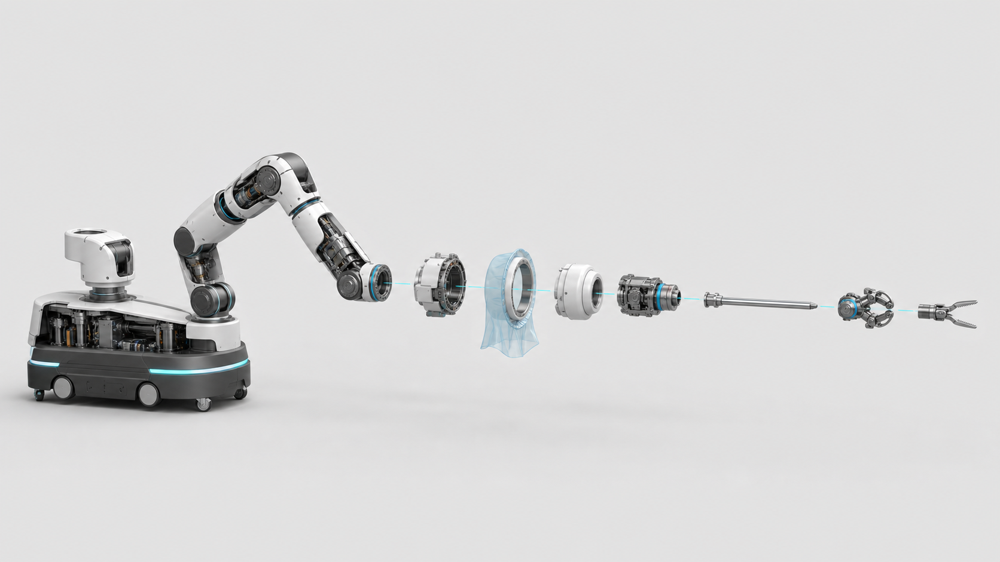
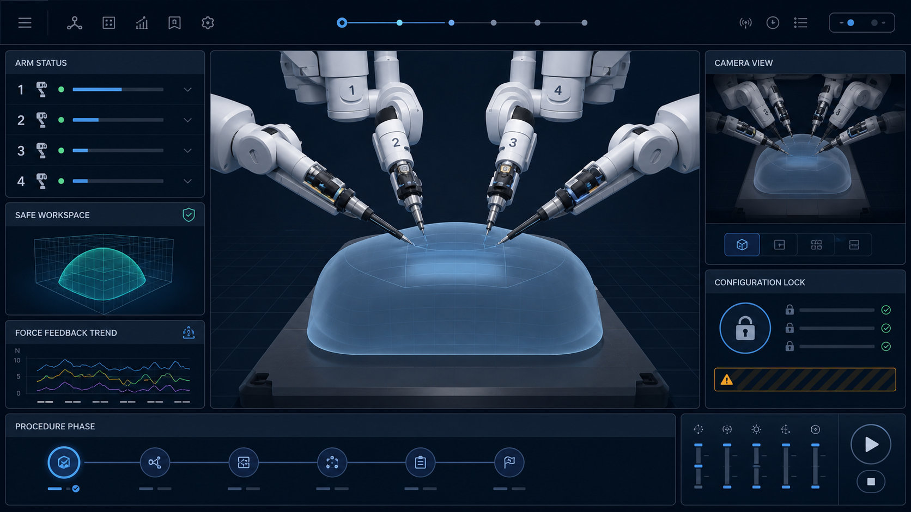
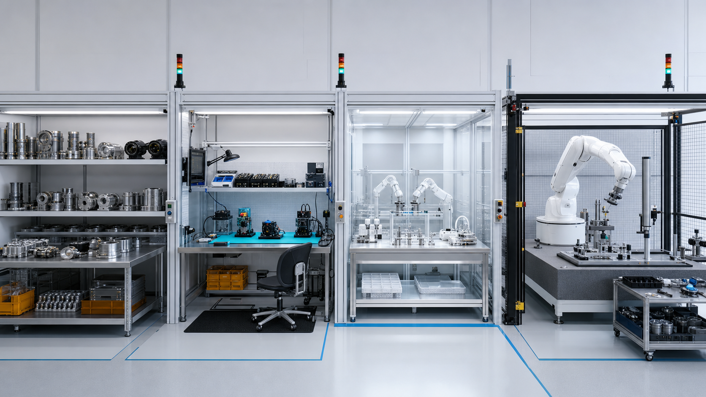

# RobotX Surgical Visual Design Package

> Concept visuals and non-clinical training media only. These files are not
> production drawings, clinical labeling, or instructions for performing surgery.

## Project renders

### Complete modular system

The reference system combines a surgeon console, medical compute cart, independent
safety/power unit, one visualization arm, and three configurable bedside instrument
arms around an empty simulation table.

### Exploded arm and extremity

The extremity runs from the locked mobile base and 7-DoF proximal arm through the
remote-center module, sterile boundary, instrument drive, shaft, distal wrist, and
end effector.

### Virtual simulator interface

The simulator exposes arm state, safe workspace, camera state, force trend,
configuration lock, and procedure phase around a neutral synthetic phantom.

### Controlled manufacturing concept

The pilot line separates incoming inspection, ESD joint/electronics assembly,
clean adapter/instrument work, and guarded final calibration.

## Deterministic technical diagrams

- [System architecture](../../assets/surgical/diagrams/system-architecture.svg)
- [Extremity stack](../../assets/surgical/diagrams/extremity-stack.svg)
- [Full-case operating state](../../assets/surgical/diagrams/case-state-machine.svg)

## Compact guides

- [Small manufacturing guide](quickstart/SMALL_MANUFACTURING_GUIDE.md)
- [Operating guide](quickstart/OPERATING_GUIDE.md)
- [Usage tutorial](quickstart/USAGE_TUTORIAL.md)

## Virtual walkthrough videos

- [Virtual Surgical Simulation](../../media/surgical/virtual-surgical-simulation.avi)
- [Virtual Procedure Walkthrough](../../media/surgical/virtual-procedure-walkthrough.avi)
- [Video storyboard and narration](quickstart/VIDEO_STORYBOARDS.md)

The videos demonstrate configuration verification, room setup, docking to a
synthetic phantom, surgeon-controlled motion, instrument exchange, safe hold,
manual-release readiness, undocking, and post-run review. They intentionally omit
patient anatomy and surgical technique.

## Visual provenance

The four PNG renders were generated with the built-in image-generation workflow
for this project. They are design concepts and may contain mechanically simplified
details. The SVG diagrams and walkthrough videos are generated deterministically
from the controlled architecture and quick guides in this repository.
